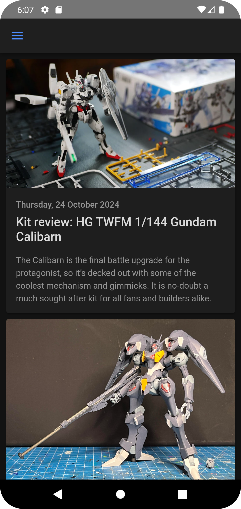
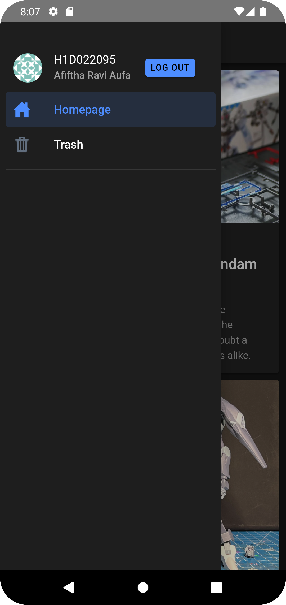

    Nama       : Afiftha Ravi Aufa

    NIM        : H1D022095

    Shift Baru : A

# Basic Menambahkan Komponen di Halaman Ionic

<div align="center">
  
&nbsp;&nbsp;&nbsp;&nbsp&nbsp;&nbsp;&nbsp;&nbsp&nbsp;&nbsp;&nbsp;&nbsp;
  
</div>

### 1. _Sebagai orang malas tentu saja saya menggunakan UI Components_

Kunjungi [Dokumentasi Komponen Ionic](https://ionicframework.com/docs/components) untuk menjelajahi berbagai komponen yang tersedia. Disana banyak komponen yang diperlukan buat bikin aplikasi tinggal pake aja gratis 100%.

### 2. _Letakkan UI Components pada Proyek Ionic_

Setelah menemukan komponen yang di inginkan, baca dulu cara pakenya terus salin kode dari dokumentasi atau buat komponen tersebut di dalam file project Ionic anda, dalam kasus ini saya pake `.vue`. Pastikan untuk menempatkannya di lokasi yang tepat untuk struktur aplikasi Anda misalnya di Homepage.

### 3. _Modifikasi Seperlunya_

Sesuaikan komponen dengan kebutuhan spesifik aplikasi. Basisnya `.CSS` jadi pasti bisa dengan mudah mengubah teks, gambar, atau gaya komponen untuk menciptakan tampilan yang sesuai dengan kebutuhan aplikasi yang bakal dibuat.

### 4. **Import Komponen**

Jangan lupa untuk mengimpor komponen yang Anda gunakan di dalam blok `<script setup lang="ts">`. Contoh pengimporan komponen yang saya gunakan:

```ts
<script setup lang="ts">
  import {(IonCard, IonContent, IonHeader, IonTitle)} from '@ionic/vue';
</script>
```

### 5. _Hore Selesai!_

Setelah semua langkah di atas selesai, jalankan proyek Ionic Anda. Komponen yang anda tambahkan sekarang sudah muncul dan siap digunakan.
